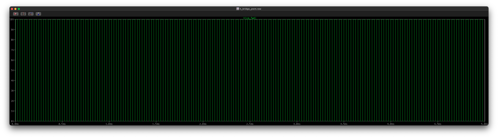
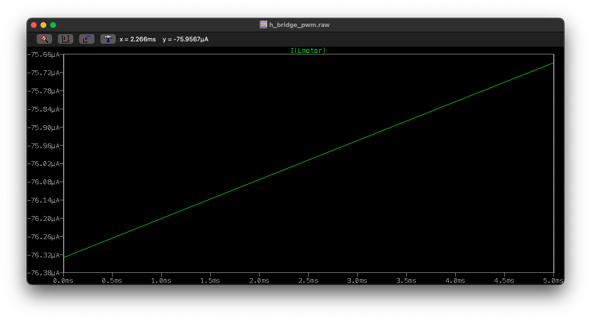

# DC Motor Driver – PWM-Based Bidirectional Control

## Overview

This project implements a PWM-based DC motor driver capable of bidirectional speed and direction control using an H-bridge architecture. The focus is on embedded motor control, power switching behavior, and safe operation under realistic electrical and thermal constraints rather than mechanical design.

The project combines embedded firmware development with analytical and simulation-based validation to reflect real-world motor driver design considerations.

---

## Objectives

- Design a PWM-controlled DC motor driver with bidirectional operation  
- Implement timer-based PWM generation in embedded C  
- Analyze switching losses and power dissipation in the H-bridge  
- Evaluate thermal limits and safe operating conditions under varying loads  

---

## System Architecture

### H-Bridge Motor Driver

An H-bridge topology is used to enable forward and reverse motor operation. Direction control is handled through digital control signals, while motor speed is regulated by varying the PWM duty cycle applied to the bridge.

### PWM Control Strategy

PWM signals are generated using hardware timers to ensure precise frequency and duty-cycle control. The control logic is designed to avoid unsafe switching conditions and maintain stable motor operation across different load conditions.

---

## Visual Overview

> Note: LTspice waveform captures are intentionally exported with a wide time axis and reduced vertical height.  
> This preserves switching detail (PWM edges, ripple, and transients) while keeping the full simulation window visible.  
> For readability, view images at full width or zoom in on regions of interest.

### H-Bridge Motor Driver Architecture

High-level block diagram showing the PWM controller, H-bridge power stage, and DC motor load.

---

### PWM Gate Signal

PWM gate voltage applied to the low-side MOSFET, exported directly from LTspice.  
The waveform is shown with a compressed vertical scale and extended horizontal window to clearly illustrate duty cycle consistency and switching frequency.

---

### Motor Current Ripple

Simulated motor current waveform demonstrating inductive current ripple under PWM excitation.  
The plot uses a long time window to show steady-state behavior rather than individual switching edges.

---

## Switching Loss Analysis

Switching losses in the power devices are analyzed using device parameters obtained from datasheets and expected operating conditions. Loss mechanisms considered include:

- Turn-on and turn-off switching losses  
- Conduction losses under load  
- Effects of PWM frequency on efficiency and power dissipation  

---

## Thermal Considerations

Thermal behavior is evaluated using estimated power dissipation and junction-to-ambient thermal resistance values. This ensures that device temperatures remain within safe operating limits during sustained operation and load variation.

---

## Simulation & Validation

An LTspice model of the H-bridge motor driver is used to validate:

- PWM switching waveforms  
- Transient current behavior  
- Direction reversal operation  

Simulation results support analytical calculations and verify expected system behavior prior to hardware implementation.

Waveform images are exported directly from LTspice rather than manually redrawn.  
As a result, voltage plots may appear visually dense or vertically compressed; this is intentional and reflects real simulation scaling rather than post-processed illustrations.

---

## Tools Used

- Embedded C (timer-based PWM control)  
- LTspice (H-bridge and switching analysis)  
- Datasheet-driven analytical calculations  

---

## Repository Structure

- `firmware/` — Embedded C source code for PWM generation and motor control  
- `analysis/` — Switching loss and thermal analysis documentation  
- `simulations/` — LTspice H-bridge simulation files  
- `images/` — Block diagrams and waveform captures  

---

## Key Takeaways

- PWM-based control enables efficient and flexible DC motor speed regulation  
- Switching losses and thermal limits are critical factors in power electronics design  
- Combining analytical calculations with simulation improves system reliability  

---

## Status

✔ Control logic implemented  
✔ Analytical and simulation-based validation completed  
🔄 Hardware implementation optional / future extension

---

# Images and Visuals

This directory contains diagrams, plots, and waveforms used to visually document the PWM-based DC motor driver project.

The visuals are intended to support the embedded firmware and analytical documentation by illustrating system architecture and expected electrical behavior.

---

## Planned Visuals

- `h_bridge_block_diagram.png`  
  High-level block diagram of the PWM controller, H-bridge, and motor load.

- `pwm_waveform.png`  
  Representative PWM gate signal showing duty-cycle-based speed control.

- `motor_current_ripple.png`  
  Example motor current waveform demonstrating inductive ripple under PWM switching.

---

## Notes

Visuals may be generated using simulation tools, plotting software, or schematic capture tools. Exact numerical values are not required; the goal is to communicate design intent and system behavior clearly.
